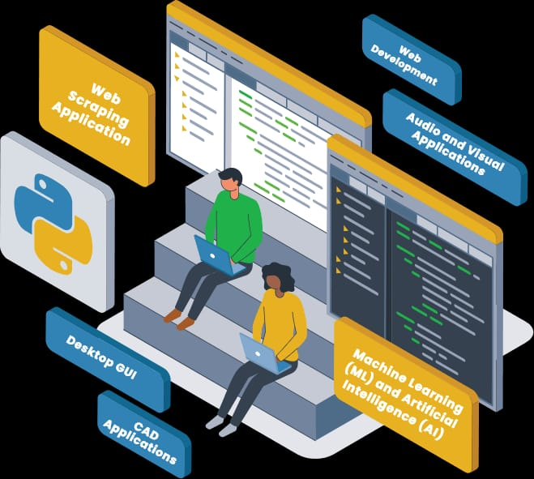

### Ciao, sono Tonenz. 
 

🛅 Sviluppatore Python/PHP/Javascript da oltre 6 anni

 

👉 Specializzato nello sviluppo di Web-App e nel Data-Scraping/Automation

 

Ho lavorato su oltre 100 progetti freelance. Alcuni di essi sono caricati qui, altri erano privati, quindi non è stato possibile caricarli per ovvi motivi.
Con una ricca esperienza di codifica e una grande capacità di problem solving, posso aiutare i clienti a portare le loro idee al prodotto. Sono un programmatore dedicato e consegno sempre i miei progetti in tempo e con tutti i requisiti di qualità

 

### Parliamo delle mie cose personali:

<!--
**Tonenz16/Tonenz16** is a ✨ _special_ ✨ repository because its `README.md` (this file) appears on your GitHub profile.

Here are some ideas to get you started:

- 🔭 I’m currently working on ...
- 🌱 I’m currently learning ...
- 👯 I’m looking to collaborate on ...
- 🤔 I’m looking for help with ...
- 💬 Ask me about ...
- 📫 How to reach me: ...
- 😄 Pronouns: ...
- ⚡ Fun fact: ...
-->
